# CI/CD 自动化部署指南

本文档介绍如何使用 GitHub Actions 自动构建 Docker 镜像并部署到 Azure VM。

## 📋 目录

1. [工作流程概述](#工作流程概述)
2. [首次设置](#首次设置)
3. [部署到 VM](#部署到-vm)
4. [更新应用](#更新应用)
5. [故障排查](#故障排查)

---

## 🔄 工作流程概述

```mermaid
graph LR
    A[本地开发] --> B[Git Push]
    B --> C[GitHub Actions]
    C --> D[构建 Docker 镜像]
    D --> E[推送到 GHCR]
    E --> F[VM 拉取镜像]
    F --> G[启动服务]
```



**优势：**
- ✅ **无需在 VM 上构建** - 避免内存不足问题
- ✅ **自动化构建** - 推送代码即触发
- ✅ **快速部署** - GitHub Runner 性能强大（7GB RAM）
- ✅ **版本管理** - 每次构建都有对应的镜像标签

---

## 🚀 首次设置

### 1. 配置 GitHub Container Registry 权限

GitHub Container Registry (ghcr.io) 默认是私有的。需要将镜像设为公开或配置访问令牌。

#### 选项 A：设置镜像为公开（推荐，最简单）

1. 推送代码后，等待 GitHub Actions 构建完成
2. 访问 https://github.com/kaixiang-uoa?tab=packages
3. 找到 `job-intelligence-dotnet-api` 和 `job-intelligence-python-api`
4. 点击每个包 → **Package settings** → **Change visibility** → 设置为 **Public**

#### 选项 B：使用 Personal Access Token（更安全）

1. 创建 GitHub Personal Access Token (PAT)：
   - 访问 https://github.com/settings/tokens
   - 点击 **Generate new token (classic)**
   - 勾选权限：`read:packages`
   - 生成并保存 token

2. 在 VM 上登录到 GHCR：
   ```bash
   echo "YOUR_GITHUB_TOKEN" | docker login ghcr.io -u kaixiang-uoa --password-stdin
   ```

---

## 📦 部署到 VM

### 第一步：推送代码触发构建

```bash
# 在本地项目目录
git add .
git commit -m "Add CI/CD workflow"
git push origin main
```

### 第二步：监控构建进度

1. 访问 https://github.com/kaixiang-uoa/job-intelligence/actions
2. 查看 "Build and Push Docker Images" workflow
3. 等待两个任务完成：
   - ✅ Build .NET API
   - ✅ Build Python API

**构建时间：** 通常 5-8 分钟

### 第三步：在 VM 上拉取并启动服务

SSH 到 VM：
```bash
ssh -i ~/.ssh/jobintel-vm_key.pem azureuser@20.92.200.112
```

进入项目目录并拉取最新代码：
```bash
cd job-intelligence
git pull origin main
```

拉取预构建的 Docker 镜像：
```bash
docker compose pull
```

启动所有服务：
```bash
docker compose up -d
```

检查服务状态：
```bash
docker compose ps
```

预期输出：
```
NAME                  IMAGE                                                    STATUS
jobintel-postgres     postgres:16-alpine                                       Up (healthy)
jobintel-python-api   ghcr.io/kaixiang-uoa/job-intelligence-python-api:latest  Up (healthy)
jobintel-dotnet-api   ghcr.io/kaixiang-uoa/job-intelligence-dotnet-api:latest  Up (healthy)
```

### 第四步：运行数据库迁移

```bash
docker compose exec dotnet-api dotnet ef database update
```

### 第五步：验证部署

**检查 Python API：**
```bash
curl http://localhost:8000/health
# 预期: {"status":"ok","version":"1.0.0","platforms":["indeed","seek"]}
```

**检查 .NET API：**
```bash
curl http://localhost:5000/api/health
# 预期: {"status":"Healthy"}
```

**访问 Swagger UI：**
```
http://20.92.200.112:5000/swagger
```

**访问 Hangfire Dashboard：**
```
http://20.92.200.112:5000/hangfire
```

---

## 🔄 更新应用

当您修改代码后，更新应用非常简单：

### 1. 推送代码
```bash
git add .
git commit -m "Your changes"
git push origin main
```

### 2. 等待 GitHub Actions 构建完成
访问 https://github.com/kaixiang-uoa/job-intelligence/actions

### 3. 在 VM 上更新
```bash
cd job-intelligence
git pull
docker compose pull
docker compose up -d
```

**就这么简单！** 🎉

---

## 🔍 故障排查

### 问题 1：无法拉取镜像 - "unauthorized"

**原因：** 镜像是私有的，需要认证

**解决方案：**
- 选项 A：将镜像设为公开（见上文"首次设置"）
- 选项 B：使用 PAT 登录（见上文"首次设置"）

### 问题 2：GitHub Actions 构建失败

**检查步骤：**
1. 访问 Actions 页面查看错误日志
2. 常见问题：
   - Dockerfile 语法错误
   - 缺少必要文件
   - 依赖包下载失败

**解决方案：**
- 检查 `.github/workflows/docker-build.yml`
- 确保 `Dockerfile` 和 `scrape-api/Dockerfile` 存在且正确

### 问题 3：容器启动失败

**检查日志：**
```bash
docker compose logs dotnet-api
docker compose logs python-api
```

**常见原因：**
- 环境变量未设置（检查 `.env` 文件）
- 数据库连接失败
- 端口冲突

### 问题 4：内存不足

**查看资源使用：**
```bash
docker stats
free -h
```

**优化建议：**
- 确保只运行必要的服务
- PostgreSQL 已经优化为 B1s VM
- 如果仍不足，考虑升级到 B2s

---

## 📊 资源对比

### 之前（在 VM 上构建）：
```
构建 .NET 项目: 需要 500+ MB RAM
构建时间: 30-60 分钟（如果不崩溃）
失败率: 高（OOM）
```

### 现在（GitHub Actions）：
```
VM 上只需拉取镜像: 50-100 MB 下载
部署时间: 2-3 分钟
失败率: 低
GitHub Runner: 7 GB RAM, 2 vCPU
```

---

## 🎯 最佳实践

1. **频繁推送小改动** - 而不是大批量修改
2. **监控 Actions 日志** - 及时发现构建问题
3. **使用语义化版本** - 未来可以添加版本标签
4. **定期清理旧镜像** - 在 VM 上运行 `docker image prune`
5. **备份数据库** - 定期导出 PostgreSQL 数据

---

## 📚 相关文档

- [GitHub Actions 文档](https://docs.github.com/en/actions)
- [GitHub Container Registry 文档](https://docs.github.com/en/packages/working-with-a-github-packages-registry/working-with-the-container-registry)
- [Docker Compose 文档](https://docs.docker.com/compose/)

---

## 🆘 需要帮助？

如果遇到问题：
1. 检查本文档的"故障排查"部分
2. 查看 GitHub Actions 日志
3. 查看 Docker 容器日志
4. 创建 GitHub Issue
